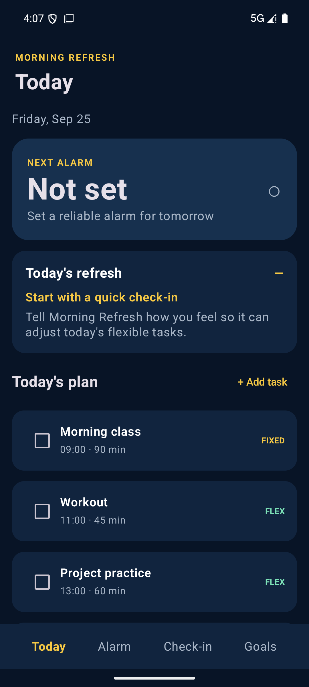
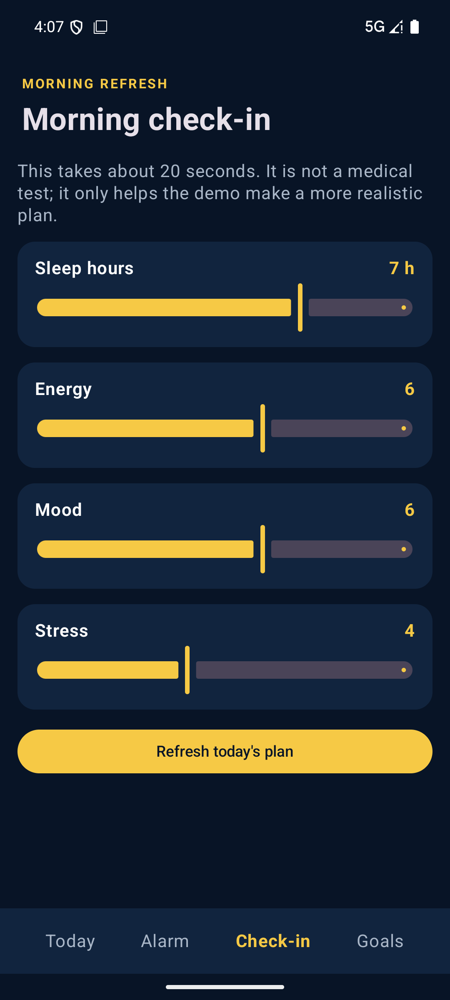
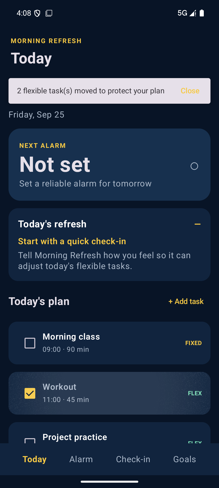
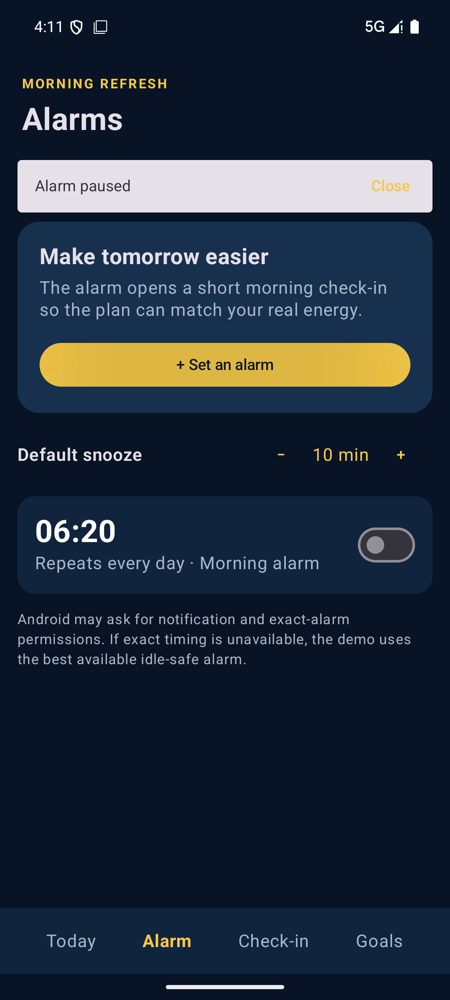
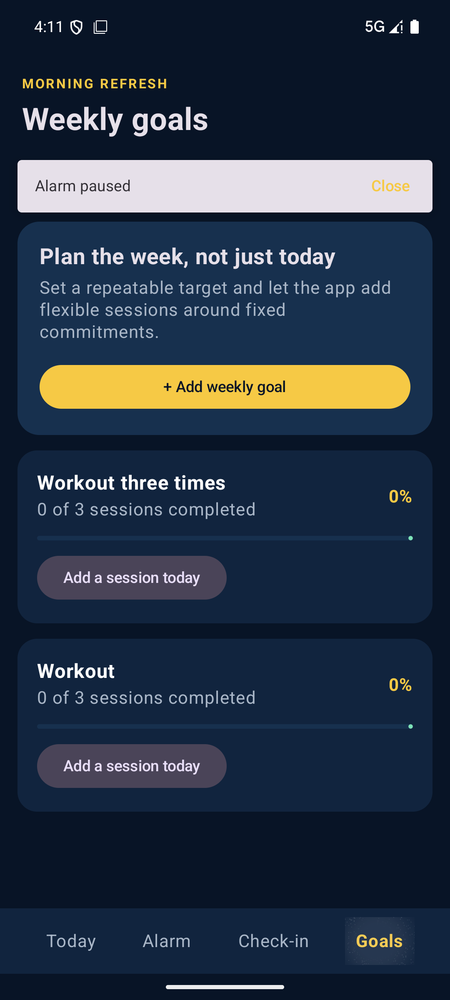

# 第一版 Demo 效果

已经成功跑起来了，Demo 已安装到 `Pixel_6` 模拟器。

## 验证结果

- `assembleDebug` 构建成功
- Room + KSP 编译成功
- 单元测试通过
- APK 需要在本地构建生成：`app/build/outputs/apk/debug/app-debug.apk`

## 首页

首页包含固定任务、弹性任务、今日建议和延迟重排功能。

## 晨间问卷

用户可以填写睡眠、精力、心情和压力评分。

## 动态调整结果

提交问卷后，系统会刷新今日计划，并根据任务状态移动弹性任务。

## 闹钟页面

闹钟页面支持设置闹钟、调整默认贪睡时间，以及启用或暂停闹钟。

## 每周目标

用户可以设置每周目标，例如一周健身三次，并添加当天的训练任务。

## 第一版已实现功能

- Kotlin + Jetpack Compose
- AlarmManager 闹钟和通知
- Room 数据库
- DataStore 设置保存
- 固定时间任务和弹性任务
- 完成任务后动态调整后续任务
- 每日晨间问卷
- 基于规则生成当天建议
- 每周目标管理

## 下一版计划

陀螺仪防作弊、摇晃检测、真正起床识别和递进挑战机制还没有加入，计划在下一版继续开发。

这个 Markdown 文件只是项目说明文档，放在 Android 项目根目录，不属于 `app/src`，不会被 Gradle 编译，也不会在每次运行 App 时自动启动。
